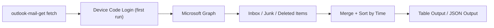

# Outlook Mail Fetcher

<div align="center">

一个面向 Hotmail / Outlook.com 的 Go CLI。  
用微软官方推荐的 `OAuth2 + Microsoft Graph` 拉取最近邮件，兼顾多账号、设备码登录和可直接 `go install` 的全局使用体验。

<p>
  
  
  
  
</p>

</div>

---

## Overview

`outlook-mail-get` 默认会检查这几个系统文件夹：

- `Inbox`
- `Junk Email`
- `Deleted Items`

然后把最近邮件合并、按时间倒序输出，适合：

- 快速看验证码邮件
- 查垃圾箱/垃圾邮件里的确认邮件
- 在脚本里直接拿 JSON

## Quick Start

### 1. 安装

```bash
go install github.com/wujunyi792/outlook-mail-get@latest
```

安装后可以直接运行：

```bash
outlook-mail-get --help
```

### 2. 配置环境变量

```bash
export MAIL_CODE_GET_CLIENT_ID="your-app-client-id"
export MAIL_CODE_GET_TENANT_ID="consumers"
```

### 3. 拉取最近邮件

```bash
outlook-mail-get fetch --limit 5
```

### 4. 输出 JSON

```bash
outlook-mail-get fetch --json --limit 5
```

## Flow



## Command Map

| Command | What it does |
| --- | --- |
| `outlook-mail-get fetch` | 拉取最近邮件 |
| `outlook-mail-get fetch --json` | 以 JSON 输出 |
| `outlook-mail-get fetch --email xxx@hotmail.com` | 指定账号拉取 |
| `outlook-mail-get fetch --reset-auth` | 本次抓取前强制重新登录 |
| `outlook-mail-get accounts list` | 查看当前已缓存账号 |
| `outlook-mail-get auth reset` | 清除本地认证状态 |

## Example Commands

### 直接传参

```bash
outlook-mail-get fetch \
  --client-id "your-app-client-id" \
  --tenant-id "consumers" \
  --limit 5
```

### 指定某个邮箱

```bash
outlook-mail-get fetch --email someone@hotmail.com --limit 5
```

### 强制重新登录后抓取

```bash
outlook-mail-get auth reset
outlook-mail-get fetch --client-id "your-app-client-id"
```

或者一步完成：

```bash
outlook-mail-get fetch --client-id "your-app-client-id" --reset-auth
```

## First Login

首次运行时会走 Device Code Flow：

- CLI 会提示你打开微软登录页
- 输入设备码
- 完成授权
- 之后本地缓存 token，后续通常无需重复登录

> Outlook.com 个人邮箱已经不适合继续走“邮箱密码直连 IMAP”这套老路。  
> 这个项目默认使用微软官方推荐的认证方式，兼容性和稳定性都更好。

## Multi-Account

当前项目支持缓存多个 Hotmail / Outlook 账号。

- 首次用某个新邮箱抓取时，会自动引导该账号完成一次登录
- CLI 会把最近一次成功使用的邮箱记为默认账号
- 不传 `--email` 时，会优先使用默认账号

查看当前缓存账号：

```bash
outlook-mail-get accounts list
```

## Microsoft Entra Setup

你需要先在 Microsoft Entra 注册一个应用，并确保：

1. `Supported account types` 包含个人 Microsoft 账号
2. `Allow public client flows` 已开启
3. 已添加委托权限 `Mail.Read`

拿到 `Application (client) ID` 后即可使用。

<details>
<summary>为什么不用邮箱密码</summary>

Outlook.com 个人邮箱现在要求新式身份验证。  
Basic Auth / 普通密码直连 IMAP 已经被逐步拦截，所以这里改成：

- 首次运行时通过设备码登录
- 本地缓存 OAuth token
- 后续通过 Microsoft Graph 读取邮件

</details>

## Output

### 默认表格输出

列包含：

- `DATE`
- `FOLDER`
- `STATUS`
- `FROM`
- `SUBJECT`

### JSON 输出字段

- `folder`
- `id`
- `subject`
- `from`
- `to`
- `date`
- `message_id`
- `unread`

## Local State

工具会在用户 Home 目录下的隐藏目录 `~/.outlook-mail-get/` 中保存本地状态：

```text
~/.outlook-mail-get/
├── config.json
└── token-cache.bin
```

其中：

- `config.json` 保存 `client_id`、`tenant_id`、默认邮箱以及账号元数据
- `token-cache.bin` 保存本机当前用户的本地 OAuth token cache

如果需要临时改用其他目录，可以设置：

```bash
export OUTLOOK_MAIL_GET_DATA_DIR="/your/custom/path"
```

如果你是从旧版本升级，原来留在项目目录下的 `./data/` 会在执行下列命令时自动迁移到 `~/.outlook-mail-get/`：

- `outlook-mail-get fetch`
- `outlook-mail-get accounts list`
- `outlook-mail-get auth reset`

当前版本不再使用 macOS Keychain / `azidentity/cache`。

## Defaults

| Item | Value |
| --- | --- |
| Default tenant | `consumers` |
| Default limit | `10` |
| Auth flow | `Device Code Flow` |
| Mail API | `Microsoft Graph v1.0` |

## Development

本地开发可以直接：

```bash
go run . fetch --limit 5
```

安装检查：

```bash
go test ./...
go test -race ./...
go vet ./...
```

## References

- [Build Go apps with Microsoft Graph](https://learn.microsoft.com/en-us/graph/tutorials/go-authentication)
- [Use the Microsoft Graph API to get Outlook mail](https://learn.microsoft.com/en-us/graph/tutorials/go-email)
- [Outlook.com POP, IMAP, and SMTP settings](https://support.microsoft.com/en-gb/office/pop-imap-and-smtp-settings-for-outlook-com-d088b986-291d-42b8-9564-9c414e2aa040)
